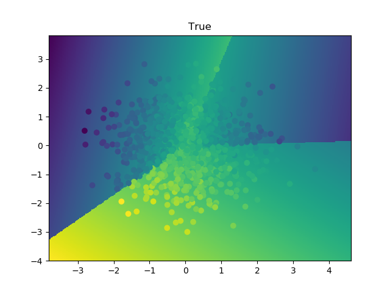
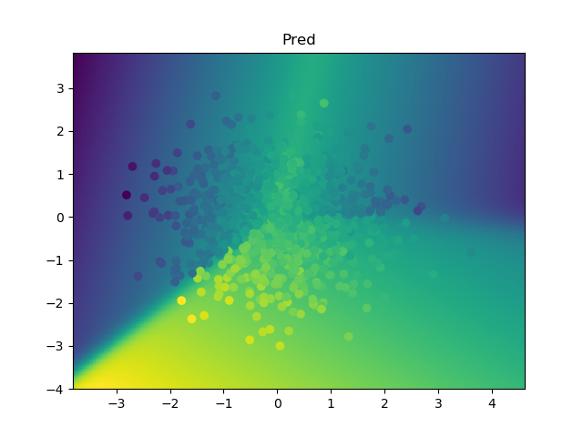
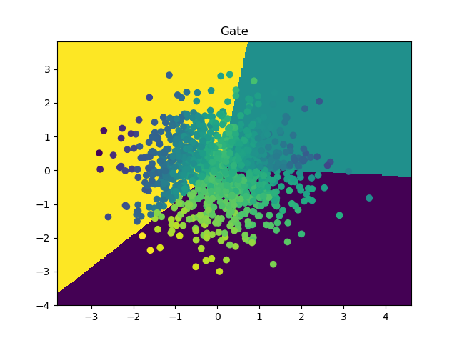

# mixture-of-experts

`scikit-learn` style estimators for classification and regression using Mixture of Experts (MoE) model based on EM algorithm. Supports any `scikit-learn` estimator as expert as long as it supports `sample_weights` parameter in its `.fit()` function.

Also includes `SoftLogisticRegression` to this end, which strips away logic in `scikit-learn` to allow for training a multi-class maximum entropy classifier with soft labels. This is used to train expert selection model. 

Adapted from 6.867 final project in Fall '15.

## An Example

In the [toy data example](examples/toy_data.py), you can visualize what this model does.

In all plots, the 2 axes are the two features of the data. The color of the scatter plot is the target associated with each data point, and the background color corresponds to some function over `(x1, x2)`.

First we simulate data, where the relationship between X and y depends on X with noise added.

After fitting a MoE model with linear regression experts, we can see it recovers the data generating process.

We can also inspect the gate model itself to see what parts of the input get mapped to each expert. 

